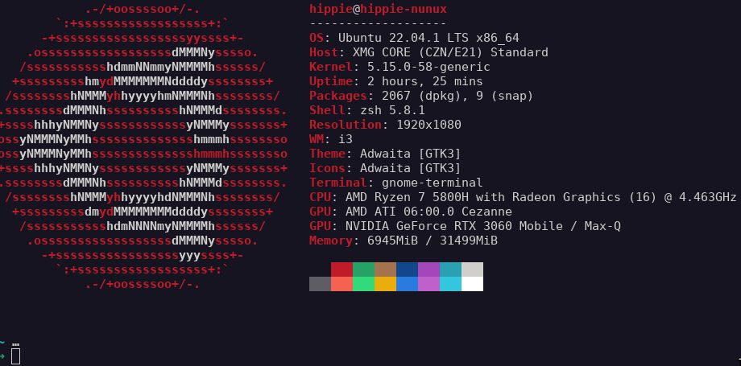
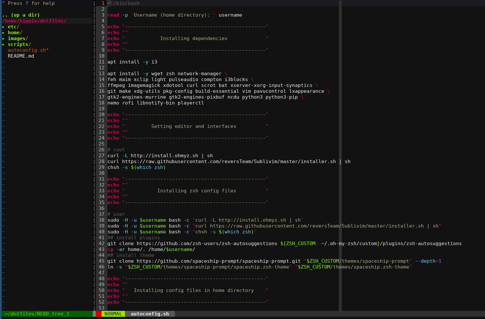
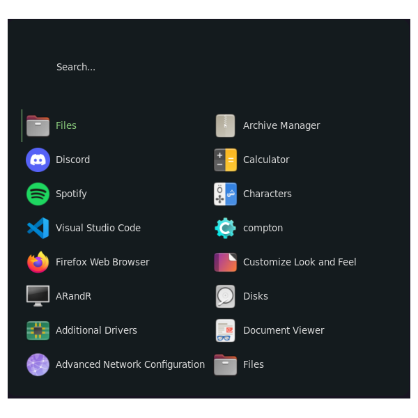
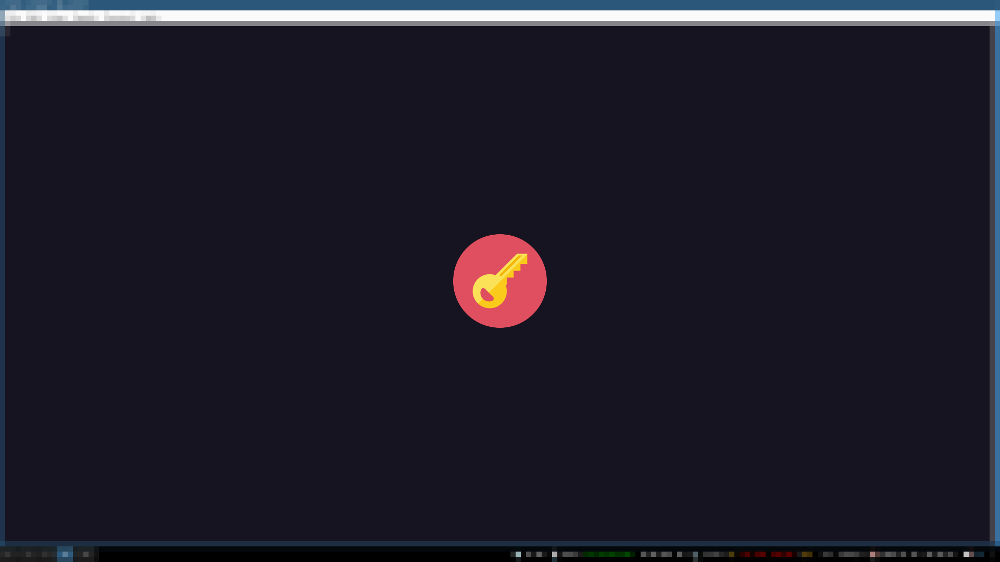

# Dotfiles
<p align="center">
  My autoconfiguration files and preferences for linux.
  <br>
  <a href="https://twitter.com/intent/follow?screen_name=hiippiiie" title="Follow"></a>
  <br>
</p>


## How to use

Run the script as root : `sudo ./autoconfig.sh`
```bash
sudo ./autoconfig.sh 
Username (home directory): hippie 
------------------------------------------------

            Installing dependencies             

------------------------------------------------
[script execution]
```

## Configuration
### Zsh

**theme:** *spaceship*
**plugins**: *git, zsh-autosuggestions*


### Vim



### i3blocks


### Rofi



### Lockscreen (mod+L)



### Shortcuts

- ctrl+prtscr: select an area to screenshot
- prtscr: take a screenshot